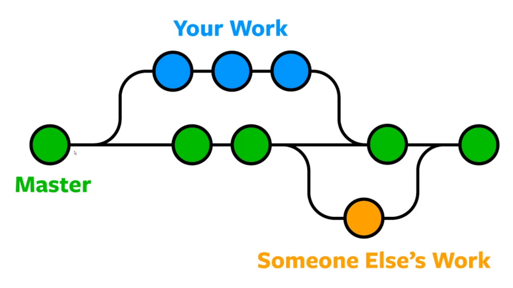

# Инструкция для работы с Git и удалёнными репозиториями

*You can read English guide on the website below:*
*https://github.com/git-guides*

## Что такое Git?
Git - это одна из реализаций распределённых систем контроля версий, имеющая как и локальные, так и удалённые репозитории. Является самой популярной реализацией систем контроля версий в мире.

## Подготовка репозитория
Для создание репозитория необходимо выполнить команду *git init*  в папке с репозиторием и у Вас создаться репозиторий (появится скрытая папка .git)

## Создание коммитов

### Git add
Для добавления измений в коммит используется команда *git add*. Чтобы использовать команду *git add* напишите *git add <имя файла>*
### Просмотр состояния репозитория
Для того, чтобы посмотреть состояние репозитория используется команда *git status*. Для этого необходимо в папке с репозиторием написать *git status*, и Вы увидите были ли измения в файлах, или их не было.

### Создание коммитов
Для того, чтобы создать коммит(сохранение) необходимо выполнить команду *git commit*. Выполняется она так: *git commit -m "<сообщение к коммиту>*. Все файлы для коммита должны быть ***ДОБАВЛЕНЫ*** и сообщение к коммиту писать ***ОБЯЗАТЕЛЬНО***.

## Перемещение между сохранениями
Для того, чтобы перемещаться между коммитами, используется команда *git checkout*. Используется она в папке с пепозиторием следующим образом: *git checkout <номер коммита>*

## Журнал изменений
Для того, чтобы посмтреть все сделанные изменения в репозитории, используется команда *git log*. Для этого достаточно выполнить команду *git log* в папке с репозиторием

## Работа с текстом
### Выделение текста
Чтобы выделить теккст курсивом, необходимо обрамить его звездочками (*) или знаком нижнего подчеркивания (_).
Например,  *вот так* или _вот так_

Чтобы выделить текст полужирным, необходимо обрамить его двойными звездочками (**) или знаком двойного нижнего подчеркивания (__).
Например,  **вот так** или __вот так__.

Альтернативные способы выделения текста жирным или курсивом нужны, чтобы мы могли совмещать оба эти способа. Например, _текст может быть выделен курсивом и при этом быть **полужирным**_.

## Списки
Чтобы выделить ненумерованный список, используйте (*) в начале строки.
Например:
* Элемент 1
* Элемент 2
* Элемент 3

Чтобы создать нумерованный список, используйте цифры. Например:
1. Номер 1
2. Номер 2

## Работа с изображениями

Чтобы вставить изображение в текст, достаточно написать следущее:
. Например:

## Ветки в Git

### Создание ветки

Для того, чтобы создать ветку, используется команда *git branch*. Делается это следующим образом в папке с репозиторием: *git branch <название новой ветки>*

### Слияние веток

Для того чтобы дабавить ветку в текущую ветку используется команда *git merge <name branch>*

### Удаление веток
Для удаления ветки ввести команду "git branch -d 'name branch'"

## Более подробная пошаговая информация в видеоролике по ссылке:
*https://youtu.be/ZzRSgQ0kqDM*